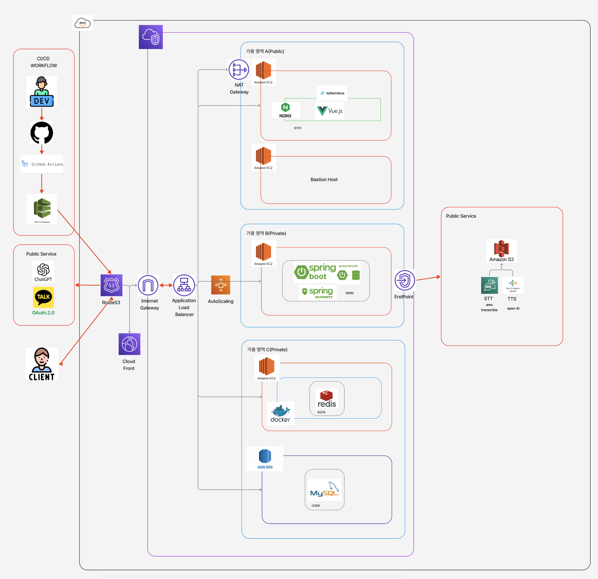
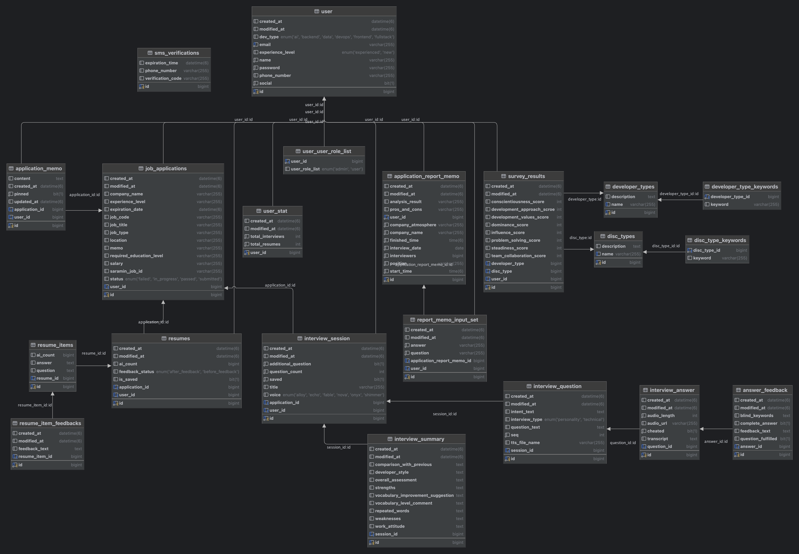

# Jobveloper – AI‑Powered Interview & Cover‑Letter Assistant (Backend)

> **Repository:** `backend/`  
> **Tech Stack:** Java 17 · Spring Boot 3.3+ · MySQL (RDS) · Redis · AWS (ECS/EC2 & S3) · OpenAI GPT & TTS · Amazon Transcribe · Docker · GitHub Actions + CodeDeploy

Jobveloper Backend는 개발자 지망생을 위한 **AI 면접 시뮬레이션**·**자기소개서 실시간 첨삭**·**성향 기반 질문 추천** 기능을 REST API로 제공합니다. GPT, TTS, STT를 결합해 사람‑같은 질문 흐름과 즉각적인 피드백을 제공하며, Redis 캐싱·Redisson Lock으로 고가용성과 일관성을 보장합니다.

---

##  Table of Contents

1. [Features](#features)
2. [System Architecture](#system-architecture)
3. [Database Schema](#database-schema)
3. [User Flow](#user-flow)
4. [Tech Stack](#tech-stack)
5. [Project Structure](#project-structure)
6. [Local Setup](#local-setup)
7. [Environment Variables](#environment-variables)
8. [API Reference](#api-reference)
9. [CI / CD Pipeline](#ci--cd-pipeline)
10. [Contributing](#contributing)
11. [License](#license)


---

## Features

| Domain | Capability                                                                           |
|--------|--------------------------------------------------------------------------------------|
| **Authentication** | JWT & Refresh Token, Redis 블랙리스트, SMS 인증                                             |
| **Interview** | GPT‑4o 기반 질문 생성·추가 꼬리질문, TTS 음성 출력, STT 음성 → 텍스트 변환, 실시간 답변 평가 & 피드백, 세션 관리 & 요약 리포트 |
| **Cover Letter** | 자기소개서 작성 · 저장, GPT 논리성/적합도 분석 & 구문 교정, DISC 성향 기반 어휘 추천                              |
| **Survey** | DISC·개발자 타입 검사, 결과 기반 질문 개인화                                                         |
| **Applications** | 채용 공고 크롤링(사람인), 지원 현황 CRUD, 메모 & 보고서 작성                                              |
| **Storage** | 보관함 (자소서·면접 기록, 회고), S3 음성 파일 관리                                                     |
| **Ops** | AOP 트레이싱, Rate Limiter, Redisson 분산 락, Async Event 처리, Health Check / Actuator       |

---

## System Architecture



---

## Database Schema



---

## User Flow

1. 사용자 회원가입/로그인 → JWT Access & Refresh 발급
2. DISC·개발자 성향 검사로 프로필 보강
3. 채용 공고 등록 → 자기소개서 질문 등록
4. 자기소개서 작성 → GPT 첨삭 → 보관함 저장
5. 면접 생성 -> 자기소개서를 기반으로 질문 생성
5. 사용자 면접 시작 → TTS 질문 출력 & 음성 답변 녹음
6. STT 변환 → GPT 분석 → 실시간 피드백 저장/조회
7. 결과 리포트·회고 확인 -> 다음 면접 준비 및 보관함 저장
8. 실제 면접 후 메모 작성 -> 보관함 저장

---

## Tech Stack

| Layer | Tech |
|-------|------|
| Language | **Java 17**, Lombok |
| Framework | **Spring Boot 3.x**, Spring Security, Spring Data JPA |
| Database | **MySQL 8** (AWS RDS) |
| Cache / Lock | **Redis 7**, Redisson FairLock |
| AI Services | **OpenAI GPT 4o**, OpenAI TTS, **Amazon Transcribe** |
| Infra | **AWS** (EC2/ALB/S3/NAT/VPC/Route 53) |
| DevOps | **Docker**, Docker Compose, **GitHub Actions**, AWS CodeDeploy |
| Observability | Spring Actuator, CloudWatch Logs, Trace ID Logging AOP |

---

## Project Structure
```
backend/
 ├── application/          # 공고·지원서 CRUD & Saramin API 연동
 ├── applicationReportMemo/# 자소서 기반 AI 메모 & 통계
 ├── interview/            # 질문 생성, 답변 분석, 세션 관리
 ├── resume/               # 자기소개서 CRUD & 항목 피드백
 ├── survey/               # DISC·개발자 성향 검사
 ├── security/             # JWT, 필터, 핸들러, Redis RefreshToken
 ├── global/               # AOP(Log, Limit, Lock), Config, Exception
 ├── user/                 # 계정, 통계, OAuth(Kakao)
 ├── sms/                  # SMS 인증 유틸리티 및 API
 └── ...
```

---

## Local Setup

프로젝트는 **docker‑compose** 기반으로 개발 환경을 빠르게 맞추었습니다.

```bash
# 1. 모든 의존 서비스(MySQL, Redis)를 포함해 기동
$ docker compose up -d            # 기본 docker-compose.yml 사용

# 2. 백엔드 애플리케이션 실행 (호스트 JDK 17 필요)
$ ./gradlew bootRun               # API → http://localhost:8080
```

> compose 파일(`docker-compose.yml`)에는 DB, 캐시, 로컬 AWS S3 에뮬레이터가 정의돼 있어 별도 설치가 필요 없습니다.

---

## Environment Variables

| Variable | Used in | Description |
|-----------|--------|-------------|
| `OPENAI_API_KEY` | Spring AI (OpenAI) | GPT / TTS 토큰 |
| `MYSQL_HOST` | Datasource | MySQL 호스트 |
| `MYSQL_DATABASE` | Datasource | DB 스키마 |
| `MYSQL_USER` / `MYSQL_PASSWORD` | Datasource | DB 계정 |
| `REDIS_HOST` | Spring Data Redis | 캐시 호스트 |
| `SARAMIN_ACCESS_KEY` | Saramin Client | 채용 API 키 |
| `JWT_SECRET` | Security | HS256 서명 키 |
| `COOLSMS_SENDER_PHONE` | SMS | 발신 번호 |
| `COOLSMS_API_KEY` / `COOLSMS_API_SECRET` | SMS | 인증 키 |
| `KAKAO_REST_API_KEY` | OAuth Kakao | 카카오 로그인 키 |
| `AWS_ACCESS_KEY_ID` / `AWS_SECRET_ACCESS_KEY` | AWS SDK | S3 / Transcribe 자격증명 |
| `AWS_S3_BUCKET` | AWS S3 | 음성 버킷 |
| `AWS_REGION` | AWS SDK | 리전 (예: `ap‑northeast‑2`) |

> 프로덕션은 **AWS Parameter Store**를 통해 변수 주입, 로컬은 `.env` 또는 `application.yml` 로 처리합니다.

---

## Response Format

모든 REST 응답은 통일된 스키마를 사용합니다.

```java
// 성공
class CommonResponse<T> {
    String message;
    int    statusCode;
    T      result;
}

// 실패
class CommonErrorResponse {
    String        message;
    String        error;
    int           statusCode;
    LocalDateTime timestamp;
}
```

---

## API Reference
- **Swagger UI:** `/swagger-ui/index.html` (dev/prod 모두 노출 제한)
- **Postman Collection:** `docs/postman/JobveloperBackend.postman_collection.json`

### Example – Start Interview

요청 예시:
```http
POST /api/interview/start HTTP/1.1
Authorization: Bearer <accessToken>
Content-Type: application/json
{
  "applicationId": 5,
  "interviewType": "ALLOY"
}
```

성공 응답 예시:
```json
{
  "message": "면접 세션이 시작되었습니다.",
  "statusCode": 200,
  "result": {
    "sessionId": 1
  }
}
```

에러 응답 예시:
```json
{
  "message": "유효하지 않은 토큰입니다.",
  "error": "Unauthorized",
  "statusCode": 401,
  "timestamp": "2025-06-19T14:22:10"
}
```

---

## CI / CD Pipeline

Jobveloper Backend은 GitHub Actions를 기반으로 자동화된 빌드 및 배포 프로세스를 운영합니다.

- `release` 브랜치 푸시 시 EC2에 직접 JAR 파일을 업로드하여 실행 중인 프로세스를 교체합니다.
- `release-alb` 브랜치 푸시 시 S3에 배포 패키지를 업로드하고, CodeDeploy를 통해 Blue/Green 방식으로 ASG에 배포됩니다.

모든 배포 과정은 테스트 및 빌드 단계를 거치며, 주요 시크릿 값은 GitHub Secrets로 안전하게 관리됩니다.

---

## Contributing

- 기능 개발 시 **Fork → feature branch → Pull Request** 플로우를 사용합니다.
- 모든 PR은 **동료 개발자 1인 이상 코드 리뷰** 후 머지됩니다.
- CI 파이프라인(빌드·테스트) 통과 후 자동 배포가 트리거됩니다.

---

## License
Apache License 2.0

---
> _Made with passion for helping developers shine at their next interview._

